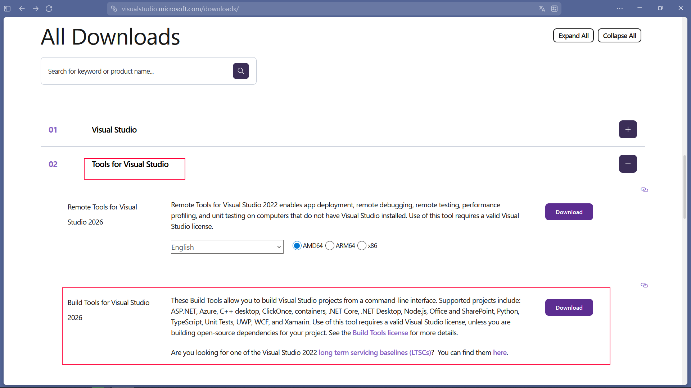

# 此项目为 [Seewk](https://github.com/WBhlietue/Seewk) 项目的 Windows10/11 环境配置以及运行工具

此项目为自动安装 CMake，Ninja，vcpkg等工具并自动配置 `vcvarsall.bat` 和 `VCPKG_ROOT` 环境变量。

# 开始使用
1. 克隆本项目
```bat
git clone https://github.com/WBhlietue/seewkRunner.git
```

2. 进入项目根目录并在终端中运行以下命令来自动安装工具链
```bat
seewkInit
```

3. 如果你还没安装 MSVC2022及以上版本，你需要手动安装 它。
- 打开 [Visual Studio 官网](https://www.visualstudio.microsoft.com/downloads/)

- 往下滑找到`所有安装`下的 `Visual Studio 工具` (图中已标红)
- 找到并下载 `Visual Studio 生成工具` (图中已标红)
- 安装后打开并选中 C++ 桌面开发 然后安装 
- 安装时注意不要在 Visual Studio Installer中安装 vcpkg，如果被自动选中请取消选中它


4. 进入 `Seewk` 项目的根目录后使用以下命令来效用 CMake 来构建
```bat
seewk make
```

5. 使用以下命令来编译并运行项目
```bat
seewk start
```